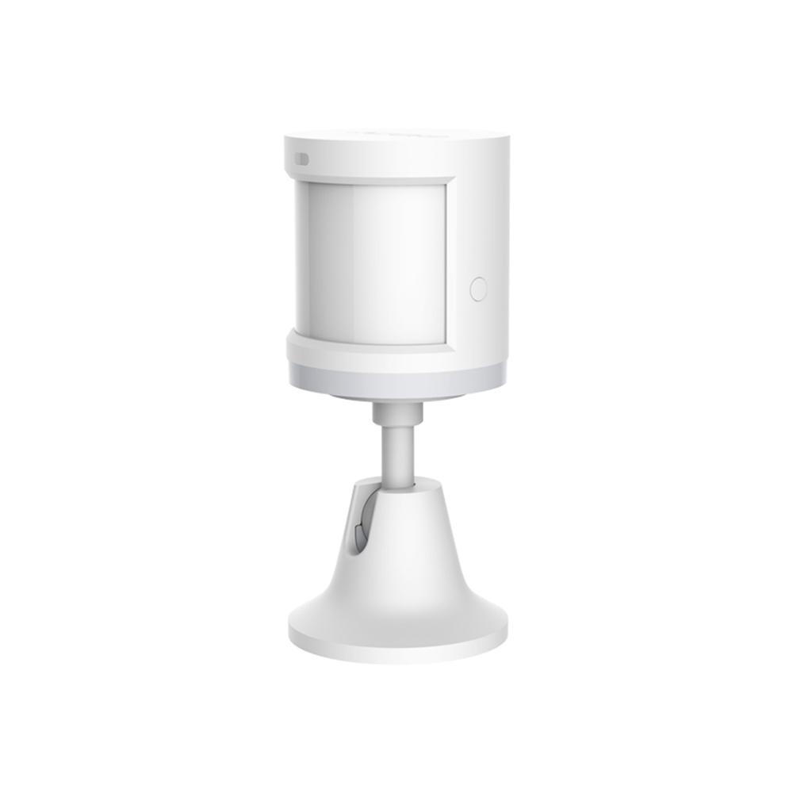
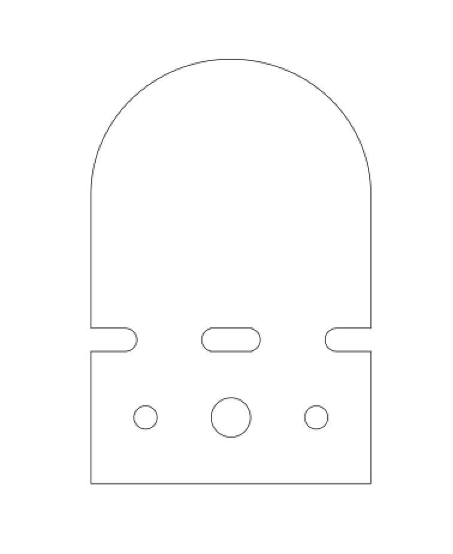
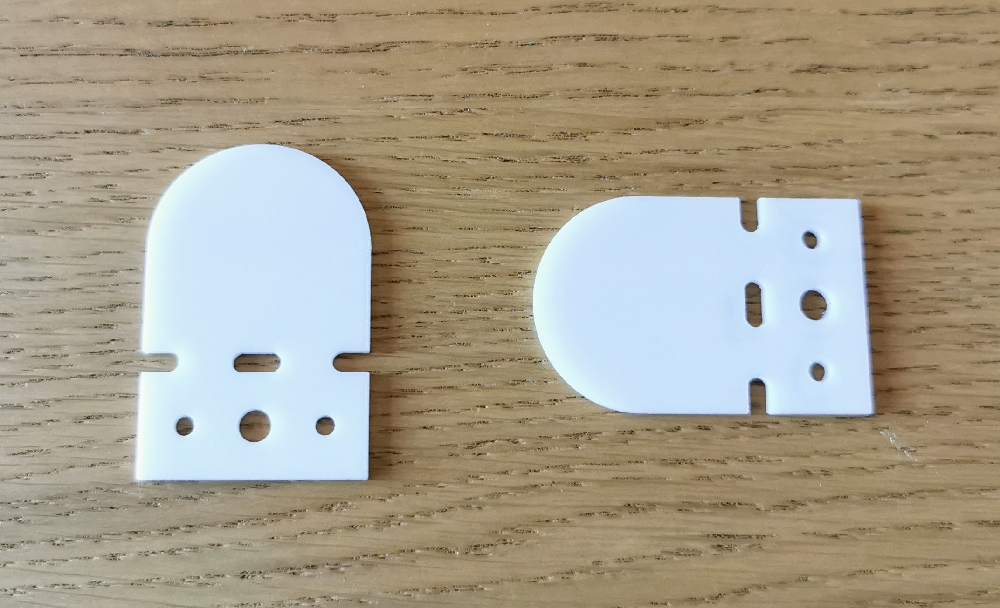

This is my first attempt at making a laser cut mount for the Xiaomi Human Body Sensor. The idea is you can screw / attacht the moount to the top of a door frame and use it to mount the sensor without damaging paint work - ideal if you're in a rented property. The cutouts should allow you to bend the mount on a strip heater if required.

This is currently a work in progress so your mileage may vary.

## Images

Xiaomi Body Sensor:  

SVG for the mount:  

Photo of the mount:  

## Assembly

- Cut the mount out of ~3mm acrylic with a laser cutter.
- Bend with a strip heater if required.

## Licence

This project is licensed under the [Creative Commons CC BY-NC-SA 4.0](https://creativecommons.org/licenses/by-nc-sa/4.0/) licence.

You are free to share and adapt the code as required, however you *must* give appropriate credit and indicate what changes have been made. You must also distribute your adaptation under the same license. Commercial use is prohibited.

## Acknowledgements

Thanks to the [London Hackspace](https://london.hackspace.org.uk/) for use of the Laser Cutter.

